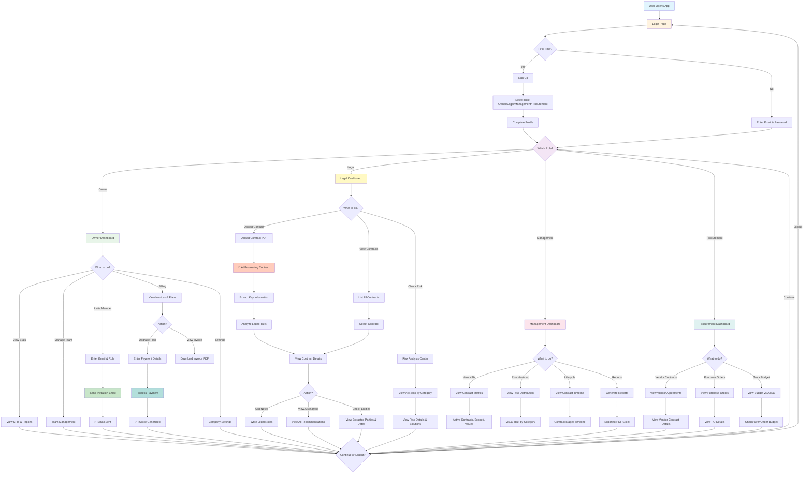
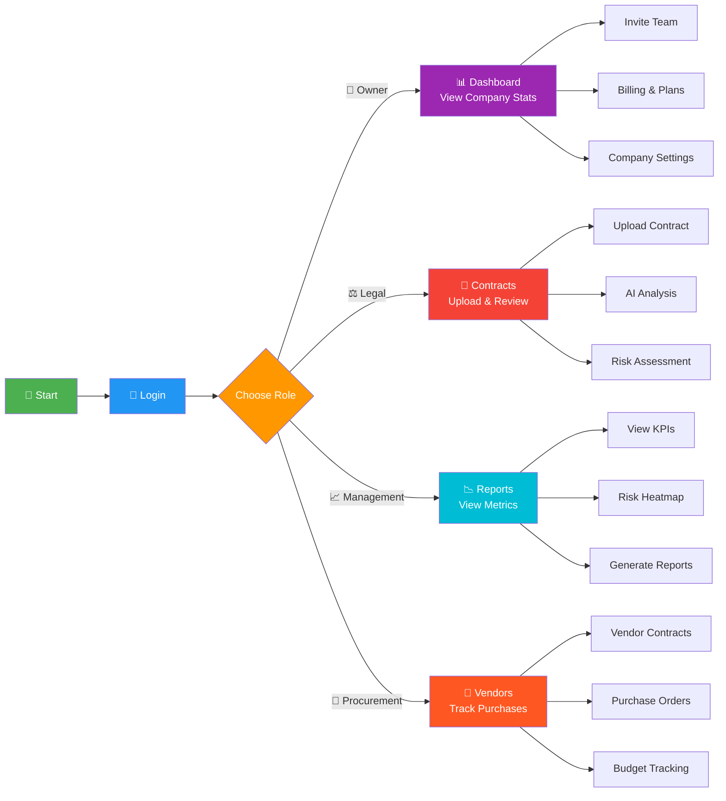
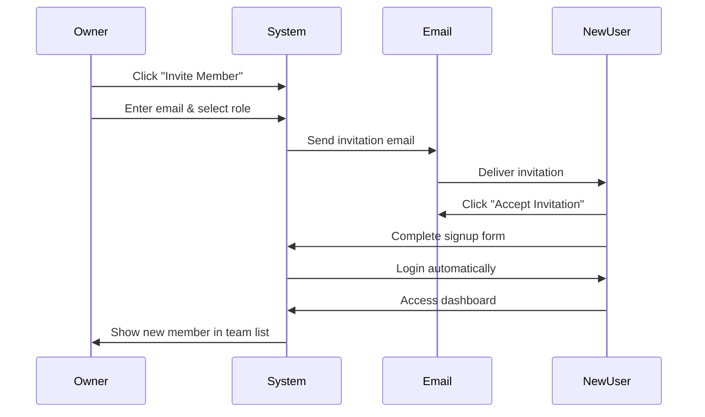
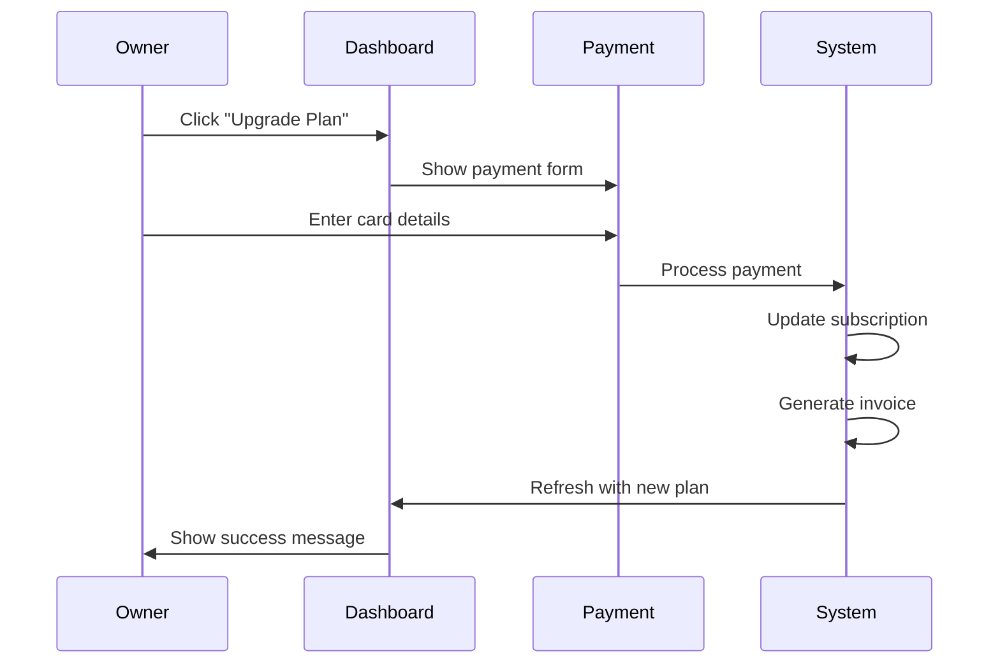
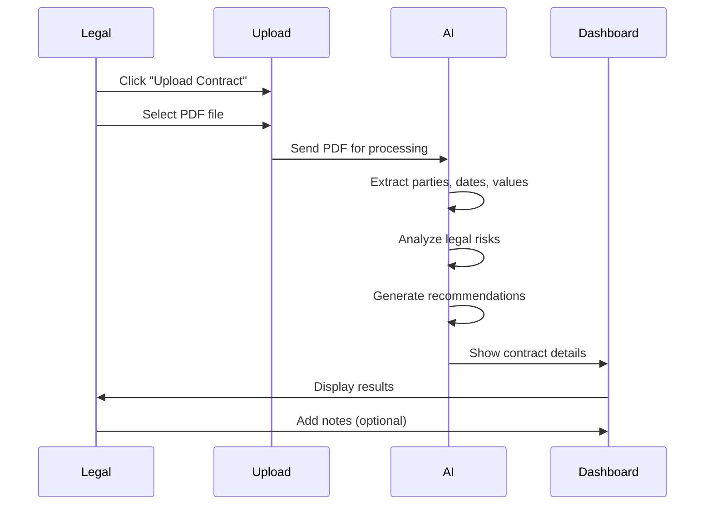
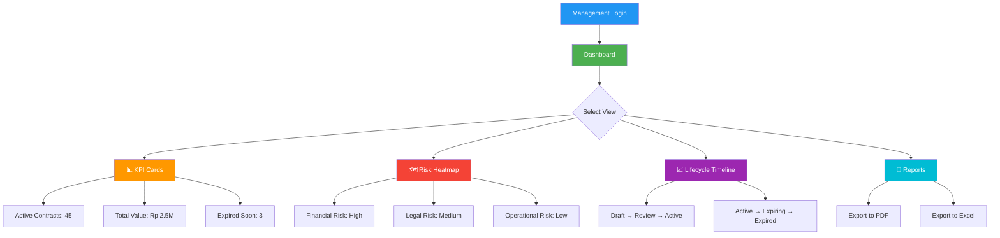
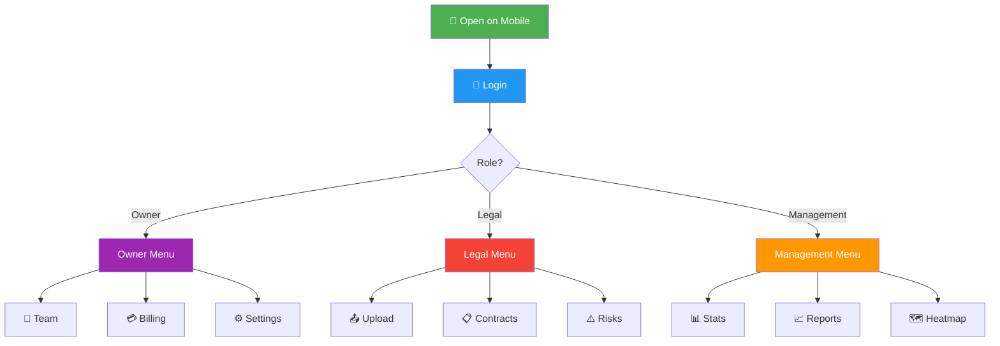

# User Flow - OptiMind Contract Management System

## 🎯 Complete User Flow (Simple for Non-IT)



## 📱 Simplified Flow for Non-Technical Users



## 🔄 Invitation Flow (Simple)



## 💳 Billing/Upgrade Flow (Simple)



## 📄 Contract Upload Flow (Simple)



## 📊 Management View Flow (Simple)



## 🎯 Key User Journeys Summary

### 1️⃣ **Owner Journey**
```
Login → Dashboard → Invite Team → Manage Billing → View Reports → Logout
```

### 2️⃣ **Legal Journey**
```
Login → Dashboard → Upload Contract → AI Analysis → Review Risks → Add Notes → Logout
```

### 3️⃣ **Management Journey**
```
Login → Dashboard → View KPIs → Check Heatmap → Generate Report → Export → Logout
```

### 4️⃣ **Procurement Journey**
```
Login → Dashboard → View Vendors → Check Purchase Orders → Track Budget → Logout
```

## 📲 Mobile-Friendly Flow



---

## 📝 How to Use These Diagrams:

1. **Copy mermaid code** (inside ``` mermaid blocks)
2. **Paste to**:
   - GitHub Markdown (renders automatically)
   - [Mermaid Live Editor](https://mermaid.live)
   - Notion (supports mermaid)
   - VS Code (with Mermaid extension)

## 🎨 Legend:

- 🟢 **Green** = Owner/Admin functions
- 🔴 **Red** = Legal team functions
- 🔵 **Blue** = Management functions
- 🟠 **Orange** = Procurement functions
- 🟣 **Purple** = Shared/Common functions

---

**Created**: October 8, 2025  
**Version**: 1.0.0  
**Status**: ✅ Ready to Present
